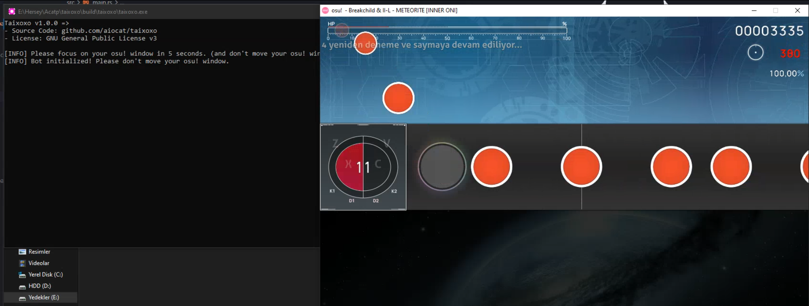

<!--
 Copyright (C) 2022 aiocat

 This file is part of taixoxo.

 taixoxo is free software: you can redistribute it and/or modify
 it under the terms of the GNU General Public License as published by
 the Free Software Foundation, either version 3 of the License, or
 (at your option) any later version.

 taixoxo is distributed in the hope that it will be useful,
 but WITHOUT ANY WARRANTY; without even the implied warranty of
 MERCHANTABILITY or FITNESS FOR A PARTICULAR PURPOSE.  See the
 GNU General Public License for more details.

 You should have received a copy of the GNU General Public License
 along with taixoxo.  If not, see <http://www.gnu.org/licenses/>.
-->

# Taixoxo

osu!taiko bot for Windows

## Before Starting

Don't sign in or play ranked maps. You might get banned. Don't be evil.

## Download

You can download latest release from [here](https://github.com/aiocat/taixoxo/releases/latest).

Don't move `taixoxo.exe` to another folder, instead move `taixoxo` folder to anywhere you want.

## Usage

- You must install modded version fo technosu skin first. If you want to install automatically, just open `setup-skin.bat` as administrator in taixoxo folder and it will install it. Then open osu! and select `Technosu Modden (v1.0)` skin.
- Switch osu! to window mode and select one of these resolution:
  - 800x600
  - 1024x768 (**recommended**)
  - 1152x864
- Open taixoxo and focus on your osu! window. it will initialize the bot after 5 (five) seconds. Please do not move your osu! window while you are using taixoxo.
- Open a game and have fun! Taixoxo will handle red, blue and yellow drums.

_if you want to see an example, please watch [this](https://www.veed.io/view/8cd3adeb-e748-47b2-9941-be513eb165a4) video._

## Tips

- It can't do `%100` acc all times. You need to retry until it does.
- If you want better acc, just increase your FPS.

### Options

| Setting              | Value     |
| -------------------- | --------- |
| Frame Limiter        | Unlimited |
| Fullscreen Mode      | Off       |
| Resolution           | 1024x768  |
| Ignore Beatmap Theme | On        |
| Raw Input            | On        |
| Background Video     | Off       |

And close all effects. Like parallax, combo bursts and so on.

## Technologies

This project is built with Rust programming language. You can view which libraries are used in `Cargo.toml` file.

## Contributing

All pull-requests and issues are welcome. Just make sure you got a brain.

If you got an error, Please open an issue at [here](https://github.com/aiocat/taixoxo/issues).

## Building

### Pre-Requests

- Rust compiler and Cargo must be installed on your computer

### Progress

- Clone the repo (`git clone git@github.com:aiocat/taixoxo.git`)
- Move into folder (`cd taixoxo`)
- Run cargo build (`cargo build --release`)
  - Or run generate release script. (`.\gen-release.bat`)

## License

Taixoxo is distributed under GPLv3 license. for more information:

- https://raw.githubusercontent.com/aiocat/taixoxo/main/LICENSE
